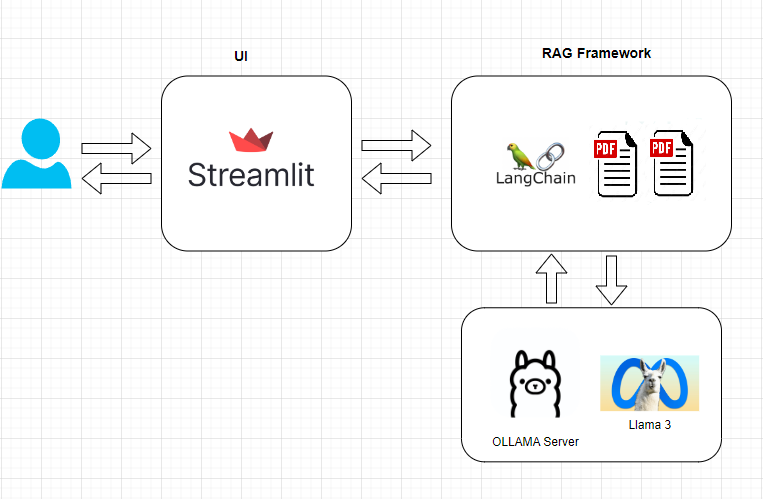

# RAG-with-Streamlit-Ollama
Building a streamlit app for Local RAG (Retrieval Augmented Generation) using LLAMA 3 with Ollama

## Requirements
* Ubuntu v22.04 (2CPU, 40GB HDD, 10Gb RAM)
* Docker
* Ollama
* Streamlit
* Langchain

## Architecture



### Deploy infrastructure
#### Install Docker
```BASH
apt update && apt install -y curl && curl https://get.docker.com -o install.sh && sh install.sh
nano /etc/docker/daemon.json
#
{"registry-mirrors": ["https://mirror.gcr.io", "https://daocloud.io", "https://c.163.com/", "https://registry.docker-cn.com"]}
#
systemctl restart docker
```

#### Install Ollama
```BASH
docker run -d -v ollama:/root/.ollama -p 11434:11434 --name ollama ollama/ollama
docker exec -it ollama sh
ollama pull owl/t-lite
ollama run owl/t-lite
# check 
<IP>/api/ps
```

### Run App
```BASH
git clone https://github.com/AIDevBytes/Streamlit-Ollama-Chatbot.git
apt install python3-pip
pip3 install -r requirements.txt
streamlit run main.py
```


## Clear
```BASH
docker stop $(docker ps -a -q)
docker rm $(docker ps -a -q)
docker system prune -a
```


## LLM models
orca-mini:3b
owl/t-lite
